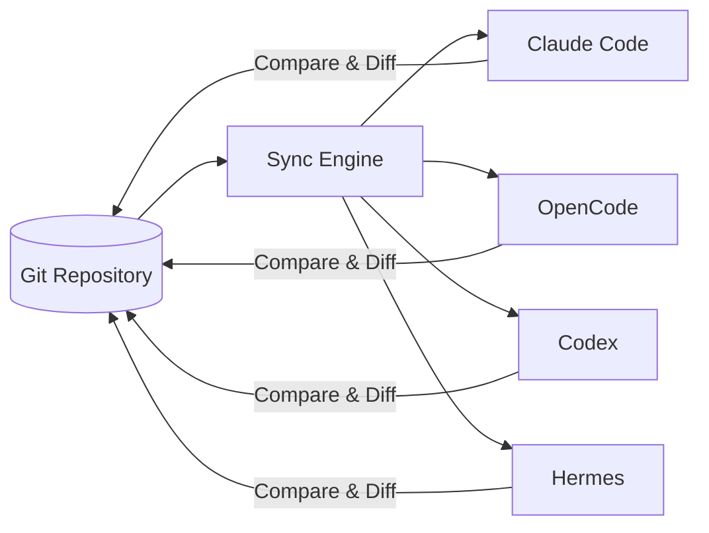
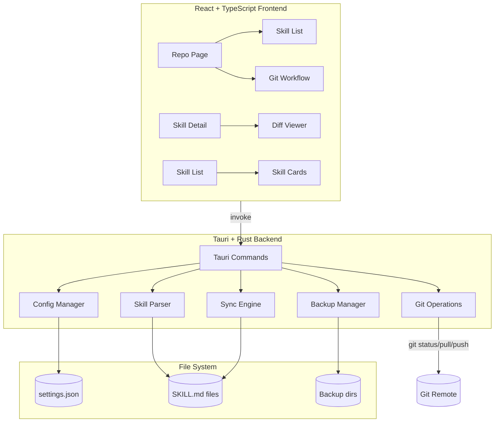
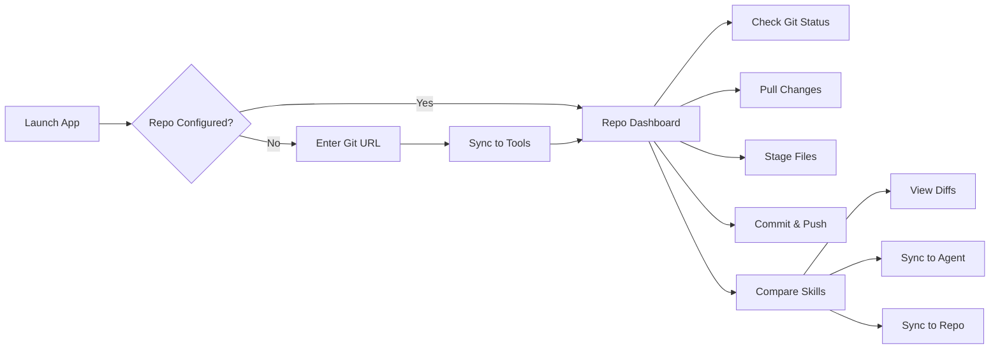

# SkillsSync

> Manage AI CLI skills from one place — sync between a Git repository and multiple agent tools.

SkillsSync is a desktop application that lets you centralize your AI agent skills (custom instructions for tools like Claude Code, OpenCode, Codex, and Hermes) in a Git repository and synchronize them across all your agent tools with a single click.

## Features



| Feature | Description |
|---------|-------------|
| **Git Integration** | Clone, pull, add, commit, push — full git workflow inside the app |
| **Multi-Agent Sync** | Sync skills to/from Claude Code, OpenCode, Codex, and Hermes |
| **Smart Comparison** | Compare skills between repo and each agent — see which are identical, modified, or exclusive |
| **Diff Viewer** | Side-by-side or inline diff of skill file changes with syntax highlighting |
| **Backup & Restore** | One-click backup of all agent skills with full restore from any backup point |
| **Git Status Tracking** | Visual indicators for untracked, modified, added, or deleted skills in the repo |
| **Cross-Platform** | Works on Windows, macOS, and Linux |
| **Dark Mode** | Built-in dark mode support |

## Architecture



## Tech Stack

| Layer | Technology |
|-------|-----------|
| **Frontend** | React 19, TypeScript, Vite 7, Tailwind CSS 4 |
| **Desktop** | Tauri 2 (WebviewWindow) |
| **Backend** | Rust (Tauri commands) |
| **Parsing** | serde_yaml, walkdir |
| **Diff** | react-diff-viewer-continued, highlight.js |
| **Dialogs** | @tauri-apps/plugin-dialog, @tauri-apps/plugin-opener |

## Getting Started

### Prerequisites

- [Node.js](https://nodejs.org/) >= 18
- [pnpm](https://pnpm.io/) >= 10
- [Rust](https://www.rust-lang.org/) toolchain (for Tauri build)
- Platform-specific Tauri dependencies — see [Tauri prerequisites](https://v2.tauri.app/start/prerequisites/)

### Install

```bash
pnpm install
```

### Develop

Starts the Vite dev server with Tauri window:

```bash
pnpm tauri dev
```

### Build

Produces a production build for your platform:

```bash
pnpm tauri build
```

## Usage



1. **Connect a repository** — enter a Git repository URL containing a `skills/` directory
2. **Sync** — click "Sync to Tools" to clone/pull and copy skills to all agent tools
3. **Manage** — use the dashboard to view git status, stage changes, commit, and push
4. **Compare** — switch to any agent tab to see skill sync status (identical, modified, agent-only, repo-only)
5. **Diff & Sync** — view detailed diffs and sync individual skills in either direction

### Supported Agent Tools

| Tool | Skills Directory |
|------|-----------------|
| **Claude Code** | `~/.claude/skills/` |
| **OpenCode** | `~/.config/opencode/skills/` (Linux/macOS), `%APPDATA%\opencode\skills\` (Windows) |
| **Codex** | `~/.agents/skills/` |
| **Hermes** | `~/.hermes/skills/` |

> Custom skill directories can be configured per tool in the app settings.

## Project Structure

```
skills-sync/
├── src/                  # React frontend
│   ├── components/       # UI components
│   │   ├── RepoPage.tsx  # Git repository dashboard
│   │   ├── SkillCard.tsx # Individual skill card
│   │   ├── SkillList.tsx # Agent skill list
│   │   ├── SkillDetail.tsx # Skill detail + diff viewer
│   │   ├── DiffViewer.tsx # Side-by-side / inline diff
│   │   ├── FileTree.tsx  # File tree browser
│   │   └── ...
│   ├── hooks/            # React hooks (useSkills, useConfig, useSync)
│   ├── utils/            # Utilities (syntax highlighting)
│   └── types.ts          # TypeScript type definitions
├── src-tauri/            # Rust backend
│   └── src/
│       ├── commands.rs   # Tauri command handlers
│       ├── config.rs     # App configuration (JSON)
│       ├── skill.rs      # Skill parsing from SKILL.md
│       ├── sync.rs       # Git & sync engine
│       └── tools.rs      # Agent tool definitions
├── package.json
├── tauri.conf.json       # Tauri window & bundle config
└── vite.config.ts
```

## Skill Format

Skills are defined by a `SKILL.md` file in a directory with YAML frontmatter:

```markdown
---
name: my-skill
description: A custom skill that does X, Y, and Z
---

# Instructions

Behave in a specific way when the user asks about X.
```

Each skill directory can also contain:
- `scripts/` — helper scripts referenced by the skill
- `references/` — reference documents used by the skill

## Configuration

The app stores configuration at:

- **Windows**: `%APPDATA%\skills-sync\settings.json`
- **macOS**: `~/Library/Application Support/skills-sync/settings.json`
- **Linux**: `~/.config/skills-sync/settings.json`

Settings include repository URL, window state, dark mode preference, and custom skill directories per tool.

## License

[MIT](LICENSE)
